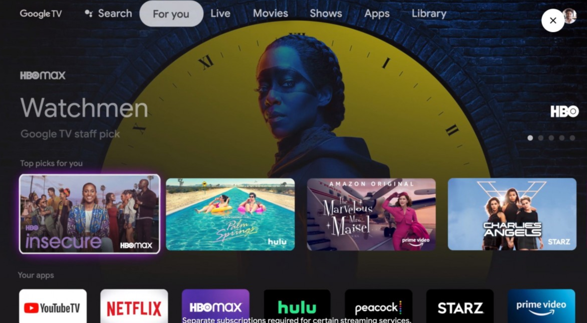
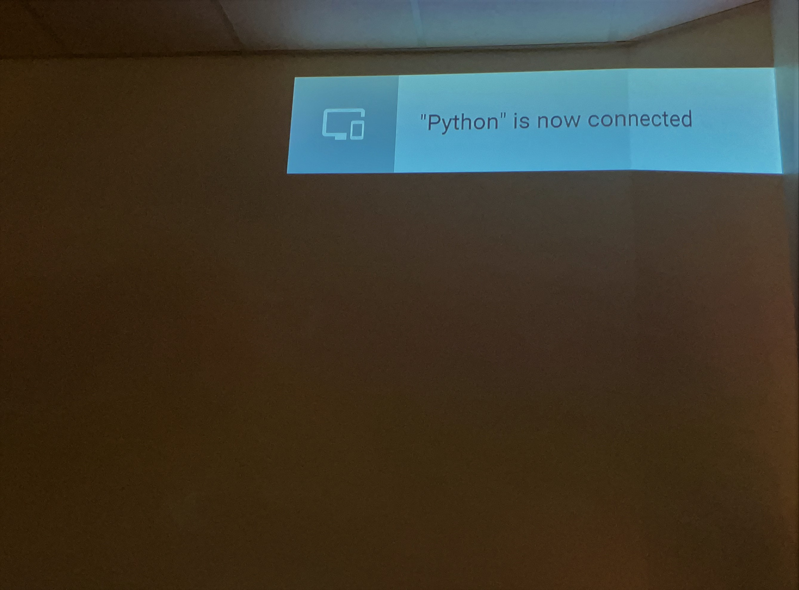
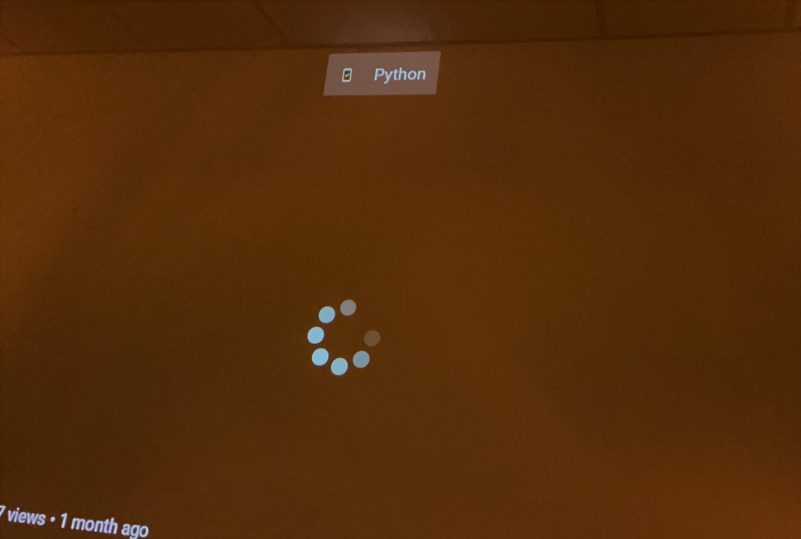
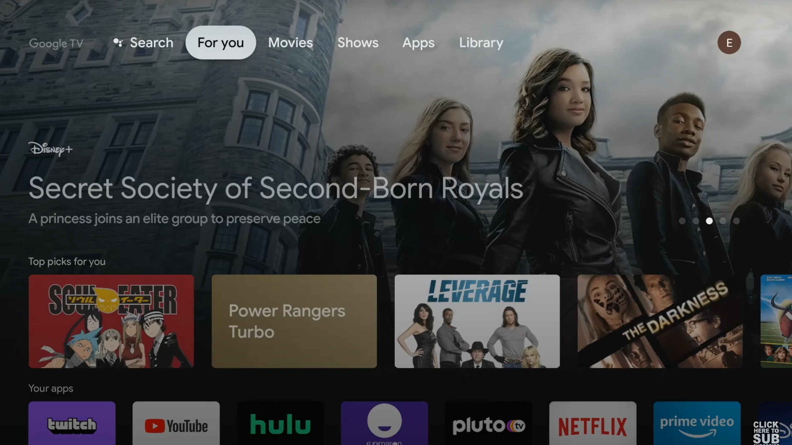
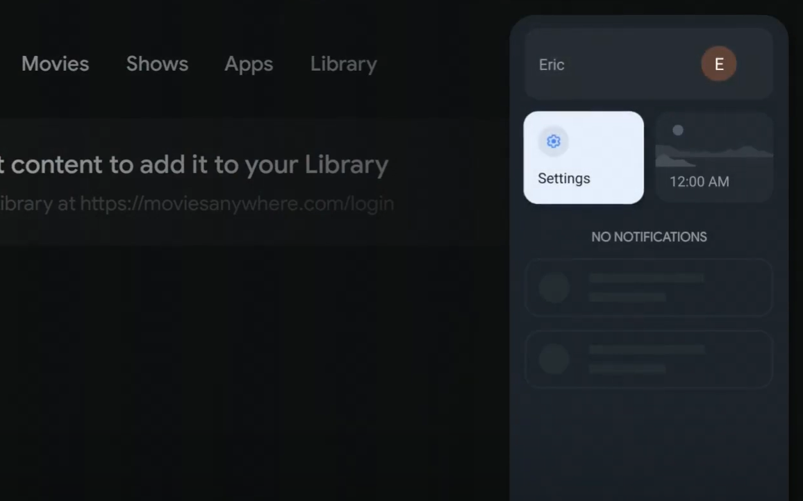
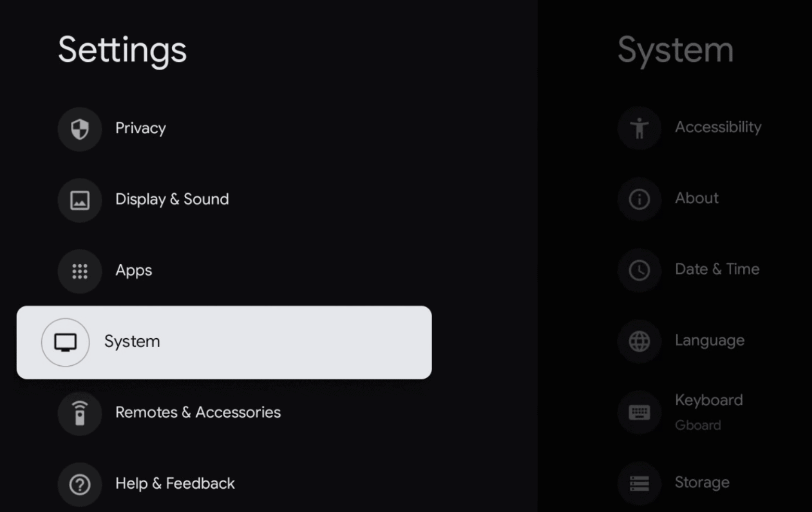
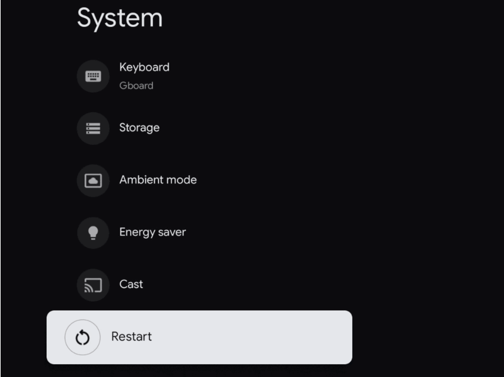
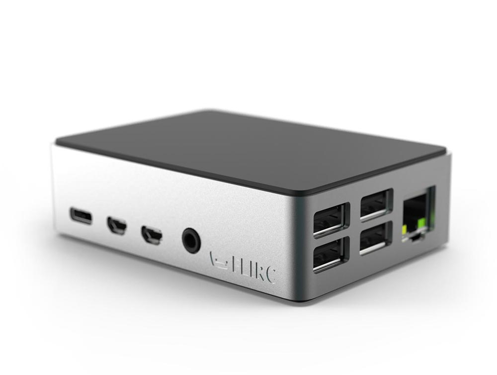
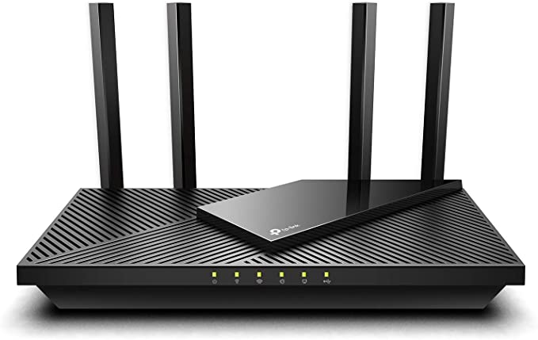
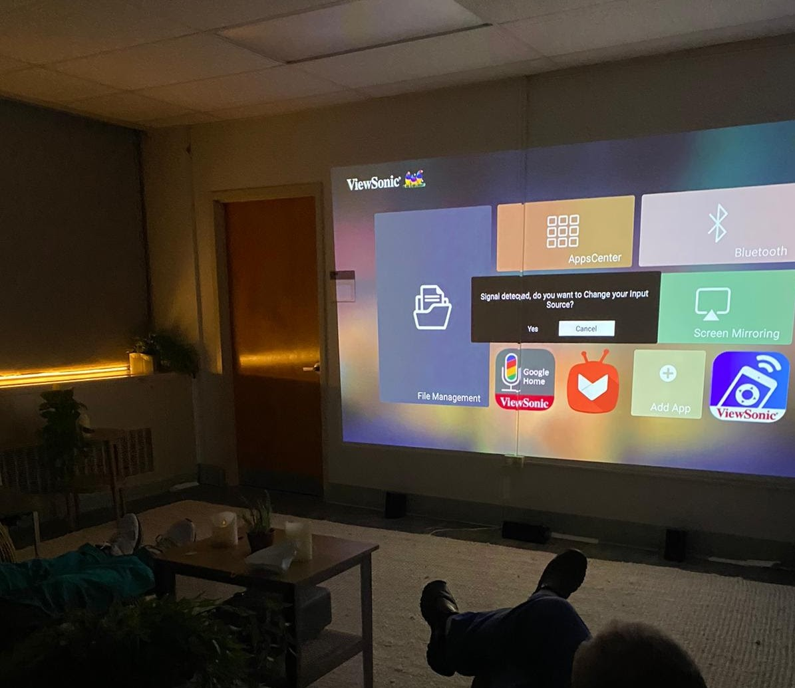

# Troubleshooting 

## General Reboot 

In majority of cases, a general reboot of the Recharge Room will solve most technical problems. 

**Steps for Rebooting:**
1. Using the white Chromecast remote, **turn the Chromecast off and then back on with the power button.**
    * If it opens onto a scene, then simply click on the Home button on the Chromecast remote before continuing to the steps below.  

  

2. On the Google TV home screen, scroll and **click into the Youtube app.**

3. Once in the Youtube app, **activate a scene** by saying **"Ok Google, activate serenity beach."** or **"Ok Google, activate emerald cove."**
    * After activating a scene, you should see a grey notification on the top right corner that says **"Python is now connected."**  

  

4. Once a scene is playing from the Youtube app, **click the Home button on the white Chromecast remote and go back to the Google TV home screen.** 
    * Then try activating a different scene like **"Ok Google, activate serenity beach."**
    * Upon your voice activation, it should automatically go to the scene, moving away from the home screen and playing the correct video.
    * You will see a black banner notification on middle of the screen that just says **"Python".**

**This is the notification that indicates the system is fully rebooted.**  

  

::: tip
This reset is needed when things aren't connecting properly to each other and the internet, and it is the easiest way to reconnect all of the devices. 
:::

## General Scenarios

### Scenes are being recognized by the speaker, but not displaying on the screen

1. Using the white Chromecast remote, **click the home button.**

2. On the Google TV home screen, **click on the circle on the top right.** This will open a menu.  

  

3. Once in the menu, click on **Settings**.  

  

4. Once in the **Settings**, click on **System**.  

  

5. To restart the Chromecast with Google TV scroll down and select **Restart**. Then wait a few moments while the Chromecast restarts. When it's complete, it will return to the home screen.  

  

6. Once you return to the home screen, follow the [general reboot steps](#general-reboot) to activate the scenes. 

### Speaker isn't recognizing any of the listed voice commands

1. Unplug the WiFi router in the room.
2. Unplug **both** of the cables from the **Raspberry Pi device**. This consists of one cable that is connected to power, as well as one cable that is connected to the router.
    * The Raspberry Pi is in an aluminum or black case that looks like this:
      
3. **Wait 30 seconds** while the router and the Raspberry Pi are disconnected.
4. **Reconnect the router to power.**
5. **Ensure that the router is connected to internet.** You can do this by referring to the green lights on the router. From left to right, the first, third, and fourth lights should be green.   

  

6. Once you have confirmed you are receiving internet, **connect the Raspberry Pi back to the router**. Then, **connect the Raspberry Pi to power**. The Pi should have a red light to indicate it's receiving power.   
7. To activate a scene, follow the [general reboot steps](#general-reboot). 

### Stuck on the Google Chromecast home screen    

Example:  

  

If the projector is stuck on the Google Chromecast home screen, **click into the Youtube App** and say, **“Ok Google, activate serenity beach.”**
  
You should see a black notification banner that says, **“Python”**, indicating that the room has reconnected. 

### Projector no signal detected

Example:  

  

If the projector screen says **"No signal detected"** or **"Signal change detected"** this indicates that the Google Chromecast could be turned off. 

Use the projector remote controller and **click on the input source button**. Then, **click onto the source that the Chromecast is plugged into**, which is usually **HDMI 1**. 

If the error continues, make sure to **click the power button on the Chromecast remote**. This should take you back to the Chromecast homepage. From here, **click onto the Youtube app** and **try activating a scene with a voice command.** 

### Idle Youtube home screen
Example:  

  

If you encounter the screen returning to an idle Youtube screensaver, simply say, **“Ok Google, activate menu.”** You should be reconnected to the Recharge Room.

### Google Chromecast stuck on loading wheel
This means that the Internet is out. **Try disconnecting and then reconnecting the router power.** Double-check that the WiFi is up, and if so, the Recharge Room should be reconnected.

### Google speaker is suddenly playing music 

If you find your Recharge Room suddenly playing music then this means someone has told the Google Assistant to do so. Simply say **“Ok Google, stop.”** and the room should be functioning as usual. 

## Issues Requiring Further Assistance

If you are experiencing any issues that aren't listed above, contact <a href = "mailto: support@studioelsewhere.co">support@studioelsewhere.co</a>.